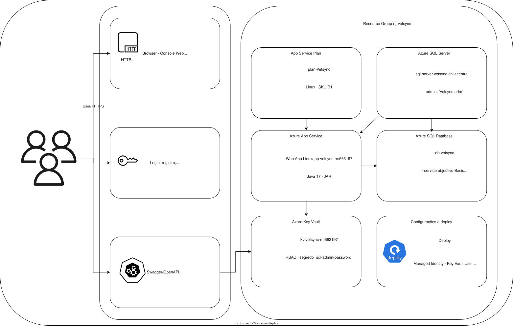

# VetSync

API REST para continuidade do cuidado e engajamento na jornada de saúde do pet. A solução permite que tutores acompanhem seus pets e eventos de saúde, enquanto veterinários e administradores gerenciam agenda, tratamentos, prescrições, pontos e recompensas.

Projeto do FIAP Challenge 2026 - parceria Clyvo Vet - Java Advanced, 2º ano ADS.

## Integrantes

| Nome | RM |
|---|---|
| Arthur Brito | RM 562085 |
| Luiz Felipe Flosi | RM 563197 |
| Pedro Brum | RM 561780 |

## Problema e solução

O acompanhamento da saúde do pet costuma ficar distribuído entre mensagens, anotações e consultas sem histórico centralizado. O VetSync centraliza o cadastro do pet, os eventos de saúde, o atendimento veterinário, os planos de tratamento e o programa de pontos em uma API protegida.

### Benefícios para o negócio

- mantém o histórico de saúde do pet persistido e consultável;
- reduz falhas de comunicação entre tutor e clínica;
- organiza a agenda e evita conflito de horários do veterinário;
- permite acompanhar tratamentos, prescrições e alertas de continuidade do cuidado;
- estimula o cuidado preventivo com pontos e recompensas;
- fornece autenticação, autorização por perfil e controle de posse dos recursos.

## Arquitetura da solução

A entrega utiliza a Opção 2 da disciplina DevOps Tools & Cloud Computing: Azure App Service com banco PaaS. App e banco não são containerizados. Todos os recursos de produção são criados por Azure CLI nos scripts deste repositório.

```text
Tutor / Veterinário / Administrador / Postman / navegador
                         |
                         | HTTPS / REST / JWT
                         v
              Azure App Service Linux
                 Java 17 / Spring Boot
                         |
                         | JDBC + Flyway
                         v
                 Azure SQL Database
                         ^
                         |
       Azure Key Vault <- Managed Identity
          (senha do banco)
```

Fluxo de publicação:

```text
1. Clone do GitHub
2. Azure CLI cria Resource Group, Key Vault, App Service e Azure SQL
3. Maven executa build e testes
4. App Service recebe o JAR
5. Spring Boot inicia e Flyway aplica as migrations
6. Usuários acessam a API pública e os dados são persistidos no Azure SQL
```

### Diagrama de arquitetura

O diagrama abaixo apresenta as personas, os componentes da aplicação, os recursos Azure, as relações entre App Service Plan, App Service, SQL Server, Azure SQL Database e Key Vault, além do fluxo de acesso à API.



## Stack

- Java 17 e Spring Boot 3.3.5;
- Spring Web, Spring Data JPA, Spring Validation, Spring Security e Actuator;
- SQL Server / Azure SQL com Microsoft JDBC Driver;
- Flyway para versionamento do schema;
- JWT para autenticação e autorização;
- Springdoc OpenAPI/Swagger;
- JUnit 5, Spring Security Test, Mockito e JaCoCo;
- H2 somente para os testes automatizados. O banco da aplicação entregue é Azure SQL, nunca H2.

## Estrutura do repositório

```text
.
├── script/
│   ├── 1-system.sh             # Resource Group, Key Vault, App Service e plano
│   ├── 2-sqlserver.sh          # Azure SQL Server, banco e firewall
│   ├── 3-backend-deploy.sh     # Testes, configurações e deploy do JAR
│   └── x-delete.sh             # Exclusão do Resource Group
├── script/Database/
│   └── script_bd.sql           # DDL completo para SQL Server / Azure SQL
├── src/main/java/              # Controllers, serviços, entidades e segurança
├── src/main/resources/
│   ├── application.properties
│   ├── db/migration/            # Flyway V1 a V10
│   └── static/index.html        # Console web/API tester
├── documentos/                 # Coleção Postman e documentação auxiliar
├── pom.xml
└── mvnw
```

## Pré-requisitos

- Java 17 ou superior;
- Azure CLI instalada e autenticada com `az login`;
- assinatura Azure selecionada:

  ```bash
  az account set --subscription "<ID_OU_NOME_DA_ASSINATURA>"
  az account show
  ```

- permissão para criar Resource Group, App Service, Azure SQL e Key Vault;
- `openssl`, `curl`, `git` e `chmod`.

O script usa a região `chilecentral`. Se essa região não estiver disponível na assinatura, altere a variável `LOCATION` nos scripts antes da execução e mantenha a mesma região nos recursos.

## Deploy completo no Azure

O vídeo da entrega deve começar pelo clone do repositório e seguir exatamente esta sequência:

```bash
git clone <URL_PUBLICA_DO_REPOSITORIO>
cd <DIRETORIO_DO_REPOSITORIO>/Backend
chmod +x mvnw script/*.sh

./script/1-system.sh
./script/2-sqlserver.sh
./script/3-backend-deploy.sh
```

Os scripts criam e configuram, via Azure CLI:

1. Resource Group `rg-vetsync`;
2. plano Linux `plan-vetsync` com SKU `B1`;
3. Web App Java 17 `app-vetsync-rm563197`;
4. Key Vault `kv-vetsync-rm563197` com a senha do Azure SQL;
5. servidor SQL `sql-server-vetsync-chilecentral` e banco PaaS `db-vetsync`;
6. regras de firewall para o IP local e para os IPs de saída possíveis do App Service;
7. identidade gerenciada do Web App e permissão `Key Vault Secrets User`;
8. Application Settings para conexão JDBC e Flyway;
9. build, testes automatizados e publicação do JAR com `az webapp deploy --type jar`.

A URL pública do App Service é:

```text
https://app-vetsync-rm563197.azurewebsites.net
```

Após o deploy, o primeiro início da aplicação executa as migrations Flyway V1 a V10. A senha do banco é gerada durante a execução de `2-sqlserver.sh`, armazenada no Key Vault e referenciada pelo App Service. Não coloque senhas, tokens, chaves reais ou arquivos `.env` no GitHub, no README ou no vídeo.

Para remover o ambiente criado pela entrega:

```bash
./script/x-delete.sh
```

Esse comando solicita a exclusão assíncrona de todo o Resource Group `rg-vetsync`, incluindo App Service, Azure SQL e Key Vault.

## Banco de dados e migrations

O DDL completo, com tabelas, colunas, chaves estrangeiras, restrições e comentários, está em [`script/Database/script_bd.sql`](script/Database/script_bd.sql). Ele representa o estado final das migrations e deve ser executado somente em um banco SQL Server/Azure SQL vazio quando for necessária a criação manual do schema.

Na execução normal, o schema é criado e versionado automaticamente pelo Flyway em `src/main/resources/db/migration`. O DDL não contém dados de teste nem credenciais.

As tabelas CORE da demonstração são:

- `TB_PET`, que representa o pet acompanhado;
- `TB_EVENTO_SAUDE`, relacionada a `TB_PET` por `TB_EVENTO_SAUDE.id_pet`.

## CRUD completo e persistência

O CRUD deve ser demonstrado na aplicação e confirmado por `SELECT` diretamente no Azure SQL, sem cortes durante a evidência. Use conteúdo significativo e pelo menos duas linhas relacionadas, por exemplo dois pets de um tutor e um evento de saúde para cada pet.

### Tabela `TB_PET`

| Operação | Endpoint | Evidência no banco |
|---|---|---|
| Inclusão | `POST /pets` | `SELECT * FROM TB_PET WHERE id_pet = ...` |
| Consulta | `GET /pets` ou `GET /pets/{id}` | mesmo registro retornado pela API |
| Alteração | `PUT /pets/{id}` | `SELECT` mostrando o novo nome/peso |
| Exclusão | `DELETE /pets/{id}` | `SELECT` sem o registro |

### Tabela relacionada `TB_EVENTO_SAUDE`

| Operação | Endpoint | Evidência no banco |
|---|---|---|
| Inclusão | `POST /eventos` | `SELECT * FROM TB_EVENTO_SAUDE WHERE id_evento = ...` |
| Consulta | `GET /eventos` ou `GET /eventos/{id}` | evento retornado pela API |
| Alteração | `PATCH /eventos/{id}/concluir` | `SELECT` mostrando status `CONCLUIDO`, observação e custo |
| Exclusão | `DELETE /eventos/{id}` | `SELECT` sem o registro |

O tutor autenticado só pode manipular seus próprios pets e eventos. O evento precisa referenciar um pet existente, um tipo de evento existente e um veterinário existente. Assim, as duas tabelas demonstram CRUD completo, relacionamento e persistência real em banco de nuvem.

## Configuração

Em produção, os valores são Application Settings do App Service. A senha utiliza referência do Key Vault.

| Variável | Finalidade |
|---|---|
| `SPRING_DATASOURCE_URL` | URL JDBC do Azure SQL |
| `SPRING_DATASOURCE_USERNAME` | usuário do Azure SQL |
| `DB_PASSWORD` | senha referenciada pelo Key Vault |
| `SPRING_FLYWAY_ENABLED` | habilita as migrations |
| `JWT_SECRET` | chave de assinatura dos tokens |
| `ADMIN_BOOTSTRAP_KEY` | chave para criar o primeiro administrador |
| `MAIL_HOST`, `MAIL_PORT`, `MAIL_USERNAME`, `MAIL_PASSWORD` | configuração opcional de e-mail |

Para desenvolvimento local, não use os valores padrão de demonstração em um ambiente compartilhado. Exporte valores próprios apenas na sessão do terminal:

```bash
export SPRING_DATASOURCE_URL='jdbc:sqlserver://<HOST>:1433;databaseName=<BANCO>;encrypt=true;trustServerCertificate=false'
export SPRING_DATASOURCE_USERNAME='<USUARIO>'
export DB_PASSWORD='<SENHA>'
export JWT_SECRET='<CHAVE_LONGA>'
export ADMIN_BOOTSTRAP_KEY='<CHAVE_DE_BOOTSTRAP>'
./mvnw spring-boot:run
```

## Execução e acesso

Para testar localmente:

```bash
./mvnw spring-boot:run
```

Para a correção da Sprint 3, use a URL pública do Azure, não `localhost`.

| Recurso | Local | Azure |
|---|---|---|
| API | `http://localhost:8080` | `https://app-vetsync-rm563197.azurewebsites.net` |
| Console web | `/index.html` | `/index.html` |
| Swagger UI | `/swagger-ui.html` | `/swagger-ui.html` |
| OpenAPI | `/v3/api-docs` | `/v3/api-docs` |
| Health check | `/actuator/health` | `/actuator/health` |

## Autenticação, perfis e fluxos

O primeiro administrador é criado por `POST /admins/bootstrap`, usando `ADMIN_BOOTSTRAP_KEY`. Depois, use `POST /auth/login` para obter o JWT e envie-o como `Authorization: Bearer <TOKEN>`.

A aplicação possui perfis com permissões diferentes e protege as rotas com Spring Security. Os principais fluxos funcionais, além do CRUD, são:

1. tutor agenda um evento de saúde para seu pet e o veterinário conclui ou o tutor cancela;
2. veterinário solicita/gerencia um plano de tratamento e seus itens;
3. eventos ou planos geram pontos que podem ser usados no fluxo de recompensas.

Endpoints disponíveis e modelos de requisição/resposta:

| Recurso | Rotas principais |
|---|---|
| Autenticação | `/auth/login`, `/auth/registrar`, `/auth/logout`, `/auth/me` |
| Administradores | `/admins/bootstrap`, `/admins` |
| Pets | `/pets`, `/pets/{id}`, `/pets/tutor/{idTutor}` |
| Eventos | `/eventos`, `/eventos/{id}`, `/eventos/{id}/concluir`, `/eventos/{id}/cancelar` |
| Tratamentos | `/planos`, `/planos/{id}` |
| Prescrições | `/prescricoes`, `/prescricoes/{id}` |
| Veterinários e agenda | `/veterinarios`, `/veterinarios/{id}/disponibilidade`, `/veterinarios/{id}/bloqueios` |
| Pontos e recompensas | `/pontos`, `/recompensas`, `/recompensas/{id}/resgatar` |

Consulte a documentação completa no Swagger, que é a referência dos contratos atuais da API, e a coleção [`documentos/JornadaPet_Postman_Collection.json`](documentos/JornadaPet_Postman_Collection.json).

## Testes automatizados

Os testes seguem a estrutura do projeto Spring e cobrem controllers, serviços, repositórios, segurança, validações e fluxos de integração. Execute:

```bash
./mvnw clean verify
```

O comando executa build, testes e relatório JaCoCo. Para gerar o relatório diretamente:

```bash
./mvnw test jacoco:report
```

Os testes usam H2 em memória apenas como apoio automatizado. Isso não substitui o teste de integração, a persistência e os `SELECT`s no Azure SQL exigidos na demonstração.

*VetSync - FIAP 2026 | Challenge Clyvo Vet | 2º Ano ADS*
